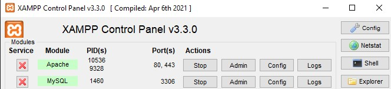

# User guide for launching the application.

1. Clone this repository to your local system and make sure that the location is in the path where your XAMPP program is installed (default path is `C:\xampp\htdocs\dashboard`), which is used for backend services Apache and MySQL.

2. Make sure you are in the folder \application-portal-backend\source\. If not, navigate to this directory using the cd command, for example: 

```bash
cd .\application-portal-backend\source\  
```

3. Afterwards, run the next command to install the necessary dependencies:

```bash
composer install
```

4. If the .env file does not exist in a project directory tree, run the following command:

```bash
cp .env.example .env
```

5. Generate a unique application key for encrypting sessions and other critical data using this command:

```bash
php artisan key:generate
```

6. Generate a secret key for signing JWT tokens:

```bash
php artisan jwt:secret
```

7. Make sure that Apache and MySQL services are running in your XAMPP Control Panel: 



8. Run migrations to create the database with defined tables:

```bash
php artisan migrate
```

9. Populate the tables with predefined data defined in seeder files:

```bash
php artisan db:seed
```

10. Now you can start the built-in PHP server on your local machine:

```bash
php artisan serve
```

11. After starting server you can access the database through the phpMyAdmin control panel by visiting the link `http://localhost/phpmyadmin/` in the browser.